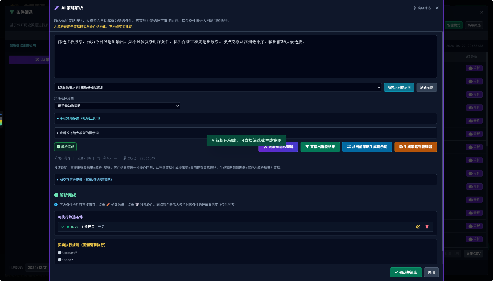
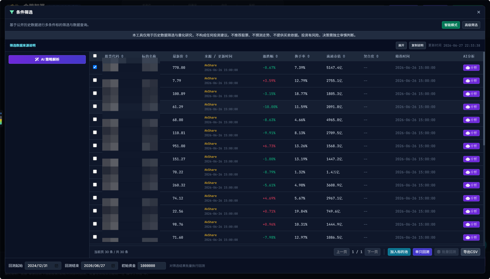
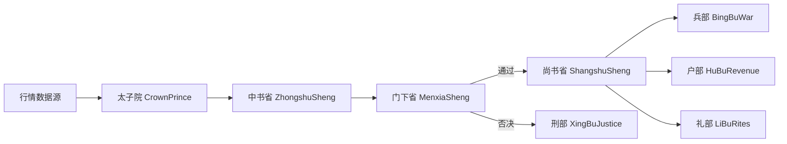

<div align="center">
  
  <h1>金策智算 · 智能投研决策系统</h1>
  <p>基于唐朝的三省六部制度建立的量化系统，分权协同、风控闭环、强化回测与执行。</p>
</div>

<p align="center">
  
  
  
  
  
</p>

<span style="color:red">**⚠️ 当前Github发布是唯一官方版本，其他任何平台、论坛发布均非本人提供，注意风险甄别！**</span>


## 项目简介

本项目采用“三省六部”思想构建量化系统，把**策略生成、风控审核、执行清算**分层解耦，支持以下核心场景：

- 历史回测与报告输出
- 多策略统一管理（内置 + 自定义）
- Web 面板配置与任务控制


## 5分钟主线导航

第一次用，先别管复杂功能，按这 5 步走就行：

1. 先启动：可先在项目根目录执行 `pip install -r requirements.txt` 预装依赖，再执行 `python server.py` 启动；如果有缺失依赖，启动过程也会自动检查并安装。
2. 再选策略：在页面顶部勾选你要跑的策略（内置/自定义都行）
3. 填参数：设置 `股票代码 + 时间区间 + ，模拟初始资金`
4. 点回测：点击“单票回测”，先拿到第一份结果和日志
5. 再扩展：需要组合、批量、BLK、TDX、策略进化时，去“操作工作台”

建议节奏：先跑通单策略，再做组合/批量，最后做策略进化，这样最不容易踩坑。

## 功能地图（按场景）

| 你的目标     | 入口               | 说明                        |
| -------- | ---------------- | ------------------------- |
| 快速验证一个策略 | 底部 `单票回测`        | 最短路径，先拿到可解释的回测结果          |
| 导入公式和板块池 | 操作工作台 -> 策略与板块工具 | TDX 公式转换、BLK 解析、批量看板      |
| 用自然语言选股   | `AI 条件筛选`         | 用中文描述策略，大模型自动转为可执行筛选条件 |
| 调整系统参数   | `配置中心`           | 数据源、风控、执行、LLM 等统一维护       |
| 运行策略进化   | 操作工作台 -> `策略进化`  | 进入 Evolution 看板执行生成/评估/迭代 |
| 查看结果报告   | `回测报告`/一致性报告     | 分析绩效、对比基线与一致性             |

## 核心特性

- 多策略并行：内置策略与用户策略统一纳管
- 风控优先：门下省一票否决机制，覆盖止损、回撤、仓位约束
- 回测闭环：从数据获取、信号执行到结果分析全链路打通
- 数据源可切换：AkShare / Tushare / 默认 API / MySQL / PostgreSQL
- 可视化运维：`server.py + dashboard.html` 提供操作面板

### AI 条件筛选

用自然语言描述你的选股思路（例如"五日内有涨停，涨停后缩量至一半以下，RSI 处于超卖区间"），系统会调用大模型将描述解析为**结构化筛选条件 + 买卖执行规则**两部分：筛选器负责初筛出候选标的，回测引擎负责按规则执行买卖和仓控。整个过程从"想法"到"可回测策略"一步到位，降低量化门槛。




### 回测模式


### 策略进化看板


## 架构设计(智能体智能）

### 三省（决策主链路）

- 太子院：数据前置校验与分发
- 中书省：策略信号生成
- 门下省：风控审核与拦截
- 尚书省：执行调度与资金清算

### 六部（职能部门）

- 吏部：策略注册与生命周期管理
- 户部：现金、成本、净值核算
- 礼部：业绩报表与策略排行
- 兵部：撮合执行与交易管理
- 刑部：违规记录与风险事件
- 工部：行情清洗与指标计算

### 流程图



## 项目结构

```text
.
├─src/
│  ├─core/            # 三省核心流程
│  ├─ministries/      # 六部职能实现
│  ├─strategies/      # 内置与自定义策略管理
│  ├─strategy_intent/ # 策略意图解析与生成
│  └─utils/           # 配置、指标、数据源封装
├─data/               # 历史数据、策略库、报告数据
├─dashboard.html      # Web 面板
├─server.py           # FastAPI 服务入口
├─main.py             # 回测入口
├─run_live.py         # 实盘监控入口
└─run_backtest.py     # 命令行回测入口
```

**项目答疑咨询** 

- 星球内容
  - 金策智算安装、部署、配置一站式教程
  - 三省六部架构设计思路与源码解读
  - 日常技术答疑、BUG 排查
- 定位：纯技术研究、工具学习、代码交流
  - 不荐股、不指导买卖、不承诺收益、不涉及任何投资建议。
  - 适合人群：量化爱好者、Python 开发者、想自建量化研究工具的学习者。
- 第二波新用户优惠券，20张，领完即止,即将恢复原价

<p align="center">
  
  
  
  
</p>

## 快速开始（3分钟版）

照着下面 4 步走，基本都能一次启动成功。

### 1. 准备环境

- 安装 Python 3.8+（建议用虚拟环境）

### 2. 安装依赖

在项目根目录执行：

```bash
pip install -r requirements.txt
```

如果你用的是指定解释器，就改成：

```bash
python -m pip install -r requirements.txt
```

### 3. 配置密钥（只放私有文件）

不要把密钥写进 `config.json`，统一放到 `config.private.json`（没有就新建一个）：

```json
{
  "data_provider": {
    "tushare_token": "你的token",
    "default_api_key": "你的api_key",
    "llm_api_key": "你的llm_key",
    "strategy_llm_api_key": "你的strategy_llm_key"
  }
}
```

系统读取优先级：环境变量 > `config.private.json`（或 `private_config_path` 指定文件）> `config.json`。

### 4. 启动项目

```bash
python server.py
```

说明：启动时会自动检查 `requirements.txt` 中声明的依赖；如果当前环境缺失依赖，系统会自动尝试安装，首启耗时可能略长。

启动后打开控制台页面，选策略、填参数、点“单票回测”即可开始跑。

### 常用命令（可选）

- Windows 一键启动：`scripts/win一键启动.bat`
- Linux/macOS 一键启动：`bash "scripts/linux&macOS系统启动.sh"`
- 指定端口启动：`python server.py --prot 8001`

## 授权说明

本项目采用 **“个人非商业免费 + 商业需授权”** 模式。

**免费使用范围（非商业）**

- 个人学习
- 学术研究
- 本地自用（不对外提供商业服务）

**以下行为必须事先取得作者书面商业授权**

- 售卖本项目或衍生版本
- 托管服务、SaaS、云端收费服务
- 二次包装后销售、分销、代理
- 任何直接或间接盈利部署

**商业授权联系**

- 联系方式：`zthx410@163.com`
- 说明：商业授权范围、费用与支持条款以双方签署协议为准。

**免责声明**

## 免责声明与用户使用协议

### 重要提示

本软件及配套程序、数据、策略代码、回测引擎（统称“本工具”）为开源量化研究与历史数据回测工具，仅面向金融知识学习、策略逻辑验证、量化技术研究用途，不构成任何投资建议。

#### 一、工具性质声明

1. 本工具仅提供历史行情数据展示、统计计算、策略回测、代码调试、技术分析研究功能。  
2. 本工具不提供任何证券买卖点位推荐、不推荐具体股票/基金/期货等标的、不预测价格走势、不提供投资决策依据。  
3. 本工具不属于荐股软件、不属于投资咨询软件、不属于智能交易决策软件。  

#### 二、风险提示

1. 证券、期货、基金等投资行为存在高风险，历史回测结果不代表未来收益，不代表策略有效性。  
2. 任何基于本工具生成的回测报告、指标结果、信号图表、策略参数，均不能作为实盘交易依据。  
3. 用户因使用本工具进行实盘交易所产生的任何盈利、亏损、纠纷、损失、民事赔偿、行政处罚、刑事责任，均由用户自行承担全部责任。  

#### 三、开发者责任免除（含民宿、茶馆、线下场所）

1. 本工具开发者（金策智算及相关主体）不具备证券投资咨询业务资质，不对外开展证券投资咨询活动，不提供任何形式的投资建议。  
2. 开发者不对任何第三方使用本工具的行为承担法律责任，包括但不限于：  
   - 个人用户、机构用户、散户社群  
   - 茶馆、会所、股民交流场所、线下投研空间  
   - 民宿、酒店、公寓、出租屋等住宿经营场所  
   - 经销商、合作方、代理商、推广渠道  
   - 任何商业或非商业场所、平台、社群  
3. 上述第三方（含民宿、茶馆等）以“金策智算”名义开展的收费荐股、投资指导、收益承诺、会员费、分成、代客理财、直播分析、线下教学等经营活动，均属其独立行为；开发者不知情、不授权、不参与、不控制、不获益、不承担任何连带责任（包括民事赔偿、行政处罚、刑事责任）。  
4. 本工具为开源发布，开发者不对软件稳定性、连续性、安全性做出任何承诺，因软件使用导致的数据丢失、设备故障、系统异常、经济损失等问题，开发者不承担任何法律责任。  

#### 四、用户义务与承诺

用户使用本工具即视为已充分理解并承诺：

1. 已明确知晓本工具仅为量化学习与研究用途，不用于任何非法证券活动、违规荐股、收费投资指导、代客理财。  
2. 具备相应金融投资风险识别能力与承受能力，自愿承担所有使用风险与法律责任。  
3. 不利用本工具从事违反《证券法》《期货交易管理条例》《证券投资咨询业务管理暂行规定》等法律法规的活动。  
4. 知晓并同意：开发者不对任何用户或第三方（含民宿、茶馆、线下场所等）的盈亏、纠纷、民事索赔、行政处罚、刑事责任承担任何责任。  

#### 五、最终解释与法律适用

1. 本声明为开源软件使用条件，构成用户使用本工具的前提。  
2. 因本工具产生的争议，适用中华人民共和国法律管辖。  

> 详细条款请见仓库根目录 `LICENSE` 文件；如与商业协议冲突，以商业协议为准。

## 贡献指南

欢迎提交 Issue 和 PR。建议流程：

1. Fork 项目并创建功能分支
2. 保持提交粒度清晰，说明改动动机
3. 提交前确保核心脚本可运行
4. 通过 PR 描述测试方法与影响范围

## Star History

[](https://star-history.com/#ScottZt/jin-ce-zhi-suan&Date)